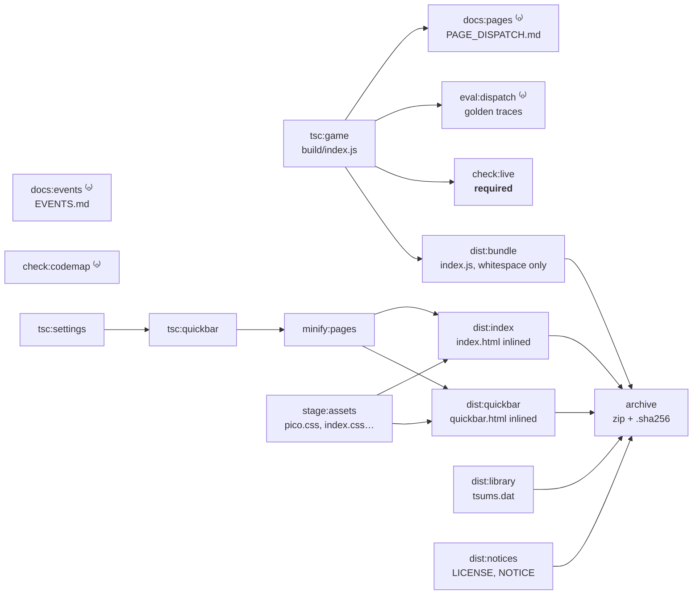
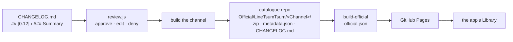

# Build and release

## The build is a dependency graph

`tools/build/build.js` is not a script that runs steps in order. Each step
declares what it `needs`, and anything whose needs are met runs, up to one job
per core — about 16 s of sequential steps down to about 4 s, the length of the
longest chain. Output is buffered and printed in declaration order, so the log
still reads top to bottom.



Steps marked ⁽ᵒ⁾ are **optional**: a stale document, a drifted code map or a
changed trace row prints its findings and never blocks a build. Their gating
forms are `npm run pages:docs:check`, `events:docs:check`, `dispatch:eval` and
`map:check`, run on their own. `check:live` is the one check in the build that
is *not* optional, because what it catches is a setting that silently does
nothing on a running script.

```js reference title="app.gap.Tsum/tools/build/build.js"
https://github.com/game-automation-platform/game-automation-scripts/blob/main/app.gap.Tsum/tools/build/build.js#L184-L227
```

`build.sh` and `build.ps1` translate flags into this and do nothing else. They
used to hold the same recipe twice, in two dialects, and had drifted.

## Channels

`config.json` names three channels — **Alpha**, **Beta**, **Production** —
each with a display name, an archive base name, a catalogue directory, a note
appended to every release message, and a `Status`: the lowest
`ReleaseStatus` that channel offers. A skill or setting marked `Alpha` is
listed on Alpha builds only; promoting it later is a one-word edit.

```json reference title="app.gap.Tsum/config.json"
https://github.com/game-automation-platform/game-automation-scripts/blob/main/app.gap.Tsum/config.json
```

The **version is not there**. It is `package.json`'s `version`, so `npm
version` and the release cannot disagree. The archive is named from both:
`TsumTsum-Alpha-0.12.zip`. The settings page carries a `$VERSION` placeholder
substituted at build time, and so does the game bundle (`ScriptVersion` in
`data.ts`), so the stats CSV can say which build played a round.

## What ships is compacted only in ways that cannot change it

terser runs with `compress: false` and `mangle: false` — the same program,
minus whitespace. Top-level names are the API: the settings page evaluates
`start({...})` and `stop()` by name, and the host calls `onEvent` and `onLog`,
so `toplevel` mangling could never be turned on. `--verify bundle` evaluates
the shipped file under the Node host shim and fails the build if a name the
bridge needs has gone.

The archive is written by `tools/build/zip.js`, a small deterministic writer,
because `zip` and `Compress-Archive` disagree about entry order and metadata
and the same `dist/` used to produce two different digests. The `.sha256`
sidecar holds the bare 64-character digest and nothing else, so a copy that has
travelled to a device can be checked back against the build it came from.

## The release pipeline



`npm run release:<channel>`:

1. Reads the `### Summary` bullets of the `## [<version>]` section of
   `CHANGELOG.md`. There is no `[Unreleased]`; a missing section or a section
   with no Summary fails **before** anything is built.
2. Renders the note exactly as the app will show it — a numbered list, the
   channel's note, the character count against `MessageMaxChars` — and waits:
   `a` approve, `e` edit in `$EDITOR`, `d` deny. An approved edit is offered
   back to `CHANGELOG.md`. `--yes` skips the gate; `--dry-run` writes nothing.
3. Builds the channel.
4. Writes into `<Catalogue>/<Directory>` in the sibling catalogue checkout:
   the zip; `metadata.json`, whose top-level fields describe this build and
   whose `Versions` array lists the last `HistoryLimit` builds so a player can
   roll back; and a per-channel `CHANGELOG.md`. Archives past the limit are
   deleted. The hash is taken from the bytes just written, so an entry can
   never describe a build other than the one beside it.
5. Prints what to do next: run the catalogue's own `build-official` script
   there and commit.

```js reference title="app.gap.Tsum/tools/release/release.js"
https://github.com/game-automation-platform/game-automation-scripts/blob/main/app.gap.Tsum/tools/release/release.js#L2-L28
```

[Release to the catalogue](../publishing/release-to-catalogue) is the
step-by-step; [Your own library source](../publishing/your-own-library-source)
explains the format the catalogue publishes and how to host one yourself.
