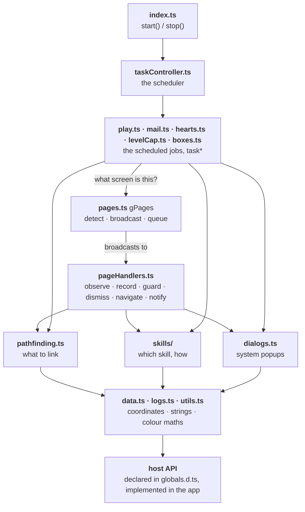

# Architecture overview

The script is one bundle with one global scope, but it has a clear shape.
Dependencies point downward: the entry point schedules tasks, tasks ask the
page router what is on screen, the router broadcasts to handlers, handlers and
tasks call into the board reader, the skills and the dialog guard, and all of
it stands on a few leaf files of data and on the host's natives.

`data.ts`, `logs.ts` and `utils.ts` know nothing about the rest. `tsum.ts` and
the files that reopen its prototype are the hub everything above the middle
row goes through. `logEvents.ts` sits below even the leaves: it is erased at
compile time, so nothing depends on it at runtime at all.

## Three couplings that are easy to miss

**`pages.ts` ↔ `pageHandlers.ts` looks like a cycle and is not.** The router
knows nothing about any particular handler; the handlers call back into `Tsum`
methods and into `gPages` itself. Load order keeps it honest: `pages.ts`
constructs `gPages` as the bundle evaluates, and `pageHandlers.ts`, concatenated
near the end, registers into it. Anything that must run when a page changes
belongs in the second file, never in the first.

**`board.ts` / `play.ts` → `skills/` is more than `useSkill`.** `link()` asks
`skillBareTapActivates` whether to fire blind after each chain, and the play
loop calls `fanWouldBeWasted` and `maybeAutoTapSkill`. All of those live in
`skills/skillCore.ts`, which is why that one file is part of the main bundle
while every other skill file is a leaf nothing references.

**`settings.ts` ↔ `index.ts` is a contract held up by `SettingKey`.** Both
sides name a setting by an enum member, so a misspelling is a build error
rather than a control that quietly does nothing. What is still silent is
*omission*: a row nobody reads in `buildRun` compiles perfectly. [Add a setting](../guides/add-a-setting)
is the checklist that closes that gap.

## Read next

- [Three worlds](three-worlds) — why the settings page, the Quick Bar and the
  script share no memory.
- [The bundle](the-bundle) — no modules, one global scope, and what that costs.
- [Run lifecycle](run-lifecycle) — what happens between Play and Stop.
- [Page router](page-router) — recognise, then react.
- [Play loop](play-loop) — one round.
- [Settings model](settings-model) — three copies of every setting, kept as one.
- [Build and release](build-and-release) — from `src/` to the catalogue.
