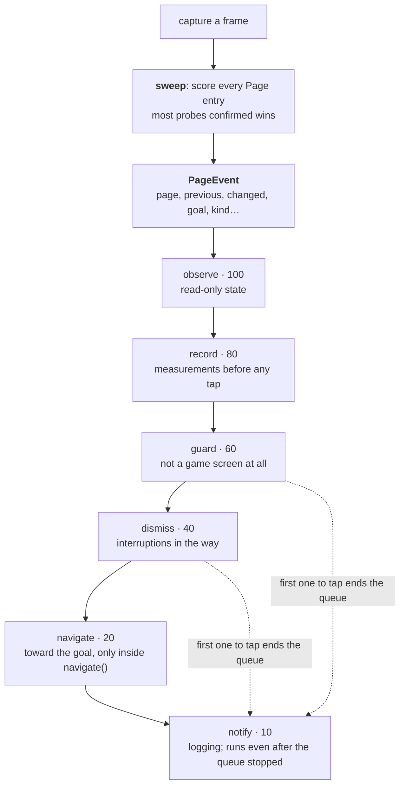

# Page router

Recognising a screen is half the job. The other half is what happens next, and
that used to be spread across every loop that happened to be looking — three
navigation loops with near-identical `switch (page)` bodies, and the Magical
Time offer cancelled in three places because any of three loops could be the
one that saw it. Two reactions on one frame, one tapping and one reading, read
or tapped a screen the other had already changed.

Now `gPages` (a `PageRouter`, in `pages.ts`) is the only thing that looks, and
it **broadcasts** what it found. Anything that wants to react registers a
subscription in `pageHandlers.ts` instead of writing another branch.



## Detection

Every screen the script knows is a **fingerprint** in the `Page` table in
`data.ts`: a handful of probe pixels, each with the colour expected there and
a threshold. `sweep` scores every entry against a captured frame and takes the
best. "Best" is **evidence first, comfort second**: the entry confirming the
most probes wins, and slack only breaks ties between fingerprints of equal
length — ranking on slack alone would let a one-probe entry that matched by
luck beat a nine-probe entry that matched genuinely.

Several `PageName`s have more than one `Page` entry — regional, emulator and
resolution variants of the same screen. That is why the enum is written by
hand rather than derived from the table: the keys are fingerprints, the names
are screens.

A caller that knows what it is watching can pass an `expect` list, which
narrows *which entries are scored at all*. The play loop's liveness check does
this with the pages a round can be on, so a page outside that set can no
longer win by being the last entry still passing over a board hidden by an
animation.

<ImagePlaceholder id="page-fingerprint-probes" alt="A game screen with its fingerprint's probe points drawn on it, each labelled with the expected colour and threshold" />

## Broadcast

Every detection produces a `PageEvent`: the page, the previous page, whether
the screen actually turned over since the last look (`changed`), the goal the
look was made with, the page's kind and, for a transient page, how long it has
left. The router files it in a bounded **history** (`gPages.history`, rendered
by `gPages.trail()` as `FriendPage(2.1s) < StartPage(0.4s)`) and runs the
queue over it.

## The queue

Subscriptions are grouped into **bands** with fixed priorities, ordered within
a band, and topologically sorted by their declared `after` dependencies. They
run **one at a time**, and the first one to touch the screen ends the queue —
everything below would be acting on a frame that no longer exists.

```ts reference title="app.gap.Tsum/src/pages.ts"
https://github.com/game-automation-platform/game-automation-scripts/blob/main/app.gap.Tsum/src/pages.ts#L144-L166
```

Whether a subscription touched the screen is its **band's** answer, not a
value it returns: `guard`, `dismiss` and `navigate` act unless their `acts`
predicate declined. Which band a subscription joins is therefore a contract:

| Band | Promise |
|:--|:--|
| `observe` | Takes no captures, taps nothing. Always runs. |
| `record` | Measurements that need an untouched screen — captures included. The fever reading is here, and that is why. |
| `guard` | Handles what is not a game screen at all: system dialogs, the root warning. |
| `dismiss` | Closes interruptions standing between the script and where it is going. |
| `navigate` | Moves toward the goal. **Silent when the look had no goal, and never on the destination page.** |
| `notify` | Logging and bookkeeping. Decides nothing, and runs even after the queue has stopped — it records what was seen. |

Nothing checks this, and `PAGE_DISPATCH.md` will happily document a wrong
choice. A handler that captures belongs in `record`; one that taps belongs in
`guard`, `dismiss` or `navigate`.

Two rules carry most of the safety:

- **`navigate` is silent with no goal.** A goal is an argument to the look
  (`gPages.navigate(PageName.X)` is the one caller that passes one), not router
  state. That is what lets the play loop call `gPages.detect()` every cycle
  without anything tapping the game away.
- **`navigate` never fires on the destination.** Arriving is `navigate()`'s
  job; a fallback back-tap firing there would walk straight off the page the
  caller asked for.

There is no blind fallback. The last mover, `nav.move.exit`, presses a page's
`back` only where that page's `PageRoutes` row says `back` is a way out. A page
with no such row is not tapped: `navigate()` logs `nav.noRoute` once and the
stall guard takes over. So **a new page that navigation has to leave needs its
exit declared**, or navigation will sit on it and say so.

## Subscriptions are data

A subscription is a list of `steps`, not a body: `tap` (an anchor of the entry
that matched — never a coordinate, because variants of a page put the same
button in different places), `tapAt`, `settle`, `sleep`, `waitOut`, `log` and
`call` for what is neither a tap nor a wait. Because the taps and the budgets
are data, `PAGE_DISPATCH.md` can print every one, and `tools/dispatchEval` can
pin them. Reading `pageHandlers.ts` top to bottom is reading the dispatch
order:

```ts reference title="app.gap.Tsum/src/pageHandlers.ts"
https://github.com/game-automation-platform/game-automation-scripts/blob/main/app.gap.Tsum/src/pageHandlers.ts#L1-L45
```

[Handle a page](../guides/handle-a-page) walks through adding one.

## Permanent and transient

Every `PageName` declares in `PageProfiles` (`data.ts`) how it leaves the
screen:

- **Permanent** — it waits for input. Still there in ten seconds, and the only
  way past it is a tap. The navigate band taps these.
- **Transient** — it dismisses itself after `durationMs`. Tapping it is worse
  than doing nothing: by the time the tap lands, the page is gone and the tap
  hits whatever replaced it. `nav.wait.transient` sits these out.

`PageProfiles` is a mapped type over `PageName`, so a name with no profile is a
build error rather than a page whose behaviour nobody decided. Durations are
quoted at 60 fps because the game counts these windows in frames, not
milliseconds; the **Device frame rate** setting scales them.

## The five looks

```ts
gPages.detect()            // → PageName, after the subscriptions have run
gPages.observe()           // → the PageEvent, filed in the history, nothing run over it
gPages.react(event)        // run the queue over an event `observe` returned
gPages.peek()              // → detection with no broadcast and no history
gPages.matches(name)       // → is *this* page up? A cheaper, per-page check
gPages.navigate(PageName.FriendPage)   // look and act until we are there
```

`detect` is `observe` then `react`. `peek` is for "where am I?" from code that
must not set anything in motion — the pause hook uses it, because a broadcast
would hand the frozen play loop a page it never looked at. Writing the
*caller* — a task that walks a flow rather than reacting to one screen — is
[Driving screens](../guides/driving-screens).

## Modes are not pages

A fever is not a screen: it is the same `GamePlaying` board with the lights
down and the gauge turned into a timer. State like that is read from its own
probe table (`ts.isFeverTime()`, `fever.ts`) and never from the matched key —
a `Page` entry's `variant` is documentation and tooling by contract; the script
only ever learns the page *name*. Formal Beast's twin gauge and the Lorcana
transformation are the other two modes, and each has a watcher modelled on
`fever.ts`.
