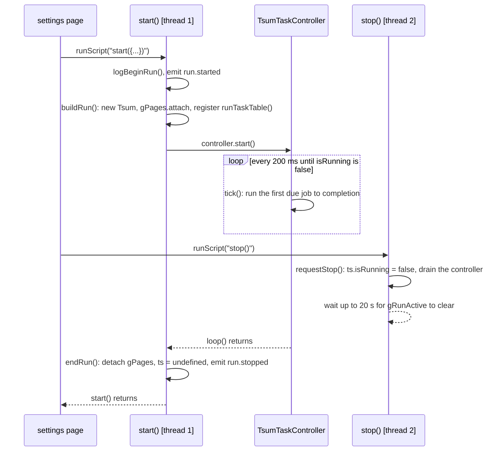

# Run lifecycle

A **run** is one `start()`…`stop()`. It owns a world — the `Tsum` object, the
page router's binding, a scheduler with a table of jobs — and it dismantles
that world itself when it ends.



## `start()`

1. Pick the log catalogue for the run's language and open a new `runId`, so
   every line from here on carries it.
2. If a run is already active, `stop()` it first. If it will not go, log
   `run.startBusy` and refuse rather than build a second world over the first.
3. Broadcast `run.started` to outside tooling.
4. `buildRun(settings)`: construct `ts = new Tsum(...)`, copy every setting onto
   it, attach the page router, reset the fever and Lorcana watchers, build a
   `TsumTaskController` and register one job per row of `runTaskTable(settings)`.
5. Yield once (`sleep(50)`) so a `stop()` that arrived mid-build can set its
   flag, then `controller.start()` — which **does not return** until the loop
   ends.
6. In a `finally`, `endRun()`: clear `gRunActive`, stop the controller, detach
   the router, drop `ts`, broadcast `run.stopped`, close the `runId`.

```ts reference title="app.gap.Tsum/src/index.ts"
https://github.com/game-automation-platform/game-automation-scripts/blob/main/app.gap.Tsum/src/index.ts#L57-L107
```

## The scheduler

`TsumTaskController` is a cooperative scheduler: every 200 ms it takes the
first job that is due and runs it **to completion**. A long job like a round
blocks the loop for the whole round; nothing else runs meanwhile. That is the
model — no timers, no workers, every native call synchronous — and it is why
`async`/`await` buys nothing here.

Which jobs there are is `runTaskTable` in `runPlan.ts`, a table compiled into
both the game bundle and the settings page, so the Run order card shows exactly
what a run will register:

```ts reference title="app.gap.Tsum/src/runPlan.ts"
https://github.com/game-automation-platform/game-automation-scripts/blob/main/app.gap.Tsum/src/runPlan.ts#L15-L60
```

When more than one job is due, the order is `JobPriority` (lowest first), and
every job's priority is distinct, so the order is the table's and nothing
else's. One-shot sweeps queued by a **Now** button go first; the app restart
next, so the chores after it run on a fresh app; then the two coin-spending
sweeps, the mailbox, the hearts, and the round last, because it is the job that
never finishes early.

Five consecutive throws from one job restart the game app — per job, so a
healthy round cannot mask a chore that throws every time.

<ImagePlaceholder id="settings-run-order-card" alt="The Run order card at the top of the General tab, listing every job the run will register and the steps of one board scan" />

## `stop()`, on a second thread

`start()` is still on the stack while the run goes, so every `stop()` arrives
on **another thread**. The host dispatches each `runScript` on its own pool
thread, and the engine hands the interpreter lock over at every `sleep()`.

`stop()` therefore tears nothing down. It calls `requestStop()` — set
`gStopRequested`, clear `ts.isRunning`, remove every task and stop the
controller — and then waits, up to `StopWaitMs` (20 s), for `gRunActive` to
clear. The running task notices `isRunning` at its next loop boundary, the
controller's loop returns, and `start()`'s `finally` does the dismantling on the
thread that owns the world.

The version before this cleared `ts` and detached `gPages` from inside `stop()`,
which pulled the world out from under a task still using it: the next detect
threw "PageRouter is not attached", and the next Play built a second world over
the wreckage. `index.ts`'s header comment tells the story; the rule it ends on
is **a run dismantles its own world**.

`requestStop()` is also what a task body may call when it decides the run
should end — the Max Round Duration cap's "stop the script" action does — so a
task never has to know about threads.

## Pause is not stop

Opening the settings panel or the Quick Bar **pauses** the run: the host sets
a flag that parks `sleep()` and every touch injector, so the script freezes
where it is. `onPause()` (`quickbar.ts`) is evaluated once *after* that flag is
set, and presses the game's own Pause button if a round is running, so the
round's clock stops too. Closing the panel resumes; the play loop's next look
sees the pause menu and `dismiss.resumeGame` presses Continue.

Play with the panel open is the one thing that ends a run: it sends a fresh
`start()` with the settings on screen.

## Rounds inside a run

The play job (`taskPlayGameQuick`) opens a round, plays it, and returns; the
scheduler calls it again 3 s later. Each round gets a `roundId` that every
`round.*` event and log record carries. [Play loop](play-loop) is the round.
