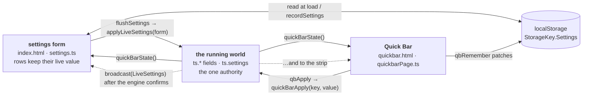

# Settings model

While a run is on, a setting is written down in **three places**: the settings
form, the world the script is playing under (`ts`), and the Quick Bar's strip.
They used to drift the moment either page was touched — a value changed in the
strip stayed invisible on the form, and the next Play started the run on what
the form still showed, quietly undoing it.



## The engine is the authority

Both pages go through one switch, `quickBarApplyOne` in `quickbar.ts`. It
writes the value onto the same field `buildRun` would have written it to, and
onto `ts.settings` beside it, so nothing is rebuilt and the round, the stats row
and the coin averages survive. That switch is the one list of what a run in
progress will take; a key it does not know is ignored in silence, which is most
of the form — a run reads those once in `buildRun`, and only a fresh `start()`
can change them.

Its companion invariant: **anything `quickBarApplyOne` can take,
`quickBarState()` has to report.** Both pages re-read the world from that reply
rather than trusting what they sent, because the engine clamps, and a skill can
hold another setting off.

## When a change lands: `LiveSettings`

The Quick Bar is opened over a round that is **paused**, not one that has
ended, so a setting the round was *set up* under cannot be changed halfway
through it — only decided again for the next one. Written straight onto a
board already dealt, it does not switch the round over; it leaves the play loop
reading that board under rules it was never dealt under.

So every live setting declares, once, when it reaches a run:

| `LiveWhen` | Meaning | Examples |
|:--|:--|:--|
| `NextRound` | **The default.** Set aside in `ts.pendingSettings` and applied at the whistle, before the walk to the next round. | skill type, Lorcana card, 5>4 and the other bonus items, track round stats |
| `Now` | Onto the running world at once. Earned only by being *read fresh, during play, by the pass that wants it*, so a board already dealt is simply played differently from the next scan on. | max chain, chains per scan, use fan, bubble strategy, skill waiting time, skill level, the between-rounds delay, max round duration |
| `Restart` | Decides which tasks a run registers, so only a fresh `start()` can move it. | auto play game, click assist |

```ts reference title="app.gap.Tsum/src/quickbar.ts"
https://github.com/game-automation-platform/game-automation-scripts/blob/main/app.gap.Tsum/src/quickbar.ts#L409-L425
```

The pages still draw the new value straight away, and the engine banners
*"Applies at the next round"*, so a round carrying on under the old skill does
not look like the pick being dropped. While a round is being played, every
Quick Bar chip wears a bar along its bottom edge saying which kind it is —
teal for this round, amber for the next.

<ImagePlaceholder id="quick-bar-chip-pending" alt="A Quick Bar chip mid-round showing the amber 'applies at the next round' bar along its bottom edge, with the 'Applies at the next round' banner over the game" />

## Why this is a table and not a convention

Three bugs here have been the same bug, and none was hard to make: rows with
no `case` in the switch that did nothing until a restart; rows a preset carries
that `applyLiveSettings` dropped in silence; and rows that had a `case` when
they should have waited for the whistle. All failed **silently, on a device,
weeks later**. Nothing in the type system has an opinion about a `switch` that
is missing an arm.

So the answer is declared per setting in `LiveSettings`, and **`npm run
live:check`** holds the code to it by running the built bundle in a vm and
driving it:

| Check | What it would have caught |
|:--|:--|
| `declared` | a row a preset carries with no answer at all |
| `switch` | declared live, no `case`, dropped in silence |
| `reported` | a live key `quickBarState` does not report — the form pushes its stale value back at the next save |
| `roundtrip` | a unit conversion (`skillWaitingTime` is seconds on the form, `ts.skillInterval` is ms) that has the panel and the run trade values forever |
| `timing` | a `nextRound` key that writes the world anyway, or one the whistle never applies |
| `stable` | a held key that shows one value while it waits and another once applied |
| `whistle` | the play loop no longer calling `quickBarApplyPending` |

What the check cannot decide is *which* of the three a new setting is. That is
a judgement — *does a pass read this during a round, against a board that was
dealt before the change?* — and the table makes it something that has to be
written down next to the `case`, where a reviewer sees it.

## The nudge, and why the poll is still there

The two WebViews can reach each other through the host:
`JavaScriptInterface.broadcast(topic)` hands one page's message to the other as
`onGapMessage(topic)`. Whichever page has just had a change **confirmed** sends
`PageMessage.LiveSettings`, and the other re-reads `quickBarState()` at once.
Three things about it are deliberate:

- **It carries no values.** The engine is the authority; a message carrying
  values would be a fourth copy to keep in step.
- **It is sent after the engine confirms**, not beside the write, so the read
  cannot overtake the write it was caused by.
- **The poll stays as the floor.** A desktop browser has no `broadcast`, and
  the engine moves settings nobody tapped — a clamp, a skill holding "Link
  MyTsum first" off — with no way to announce it. So the form also re-reads
  every few seconds while it is on screen.

A second topic, `PageMessage.Presets`, means *a preset was saved, deleted or
loaded*: a preset is a whole form, most of which no run can take live, so what
moved is the **store**, and the form re-reads that as well as the run.

## Share codes and presets

`SHARE_SLOTS` in `settings.ts` is the list of settings a share code carries:
one bit per boolean, one slot character plus a base-36 value per non-boolean
that is not at its default, a checksum and a terminator. A code is short
enough to paste into a chat — 18 characters for stock settings.

```ts reference title="app.gap.Tsum/src/settings.ts"
https://github.com/game-automation-platform/game-automation-scripts/blob/main/app.gap.Tsum/src/settings.ts#L1308-L1336
```

Rules that keep it honest:

- **A code is a whole configuration, not a patch.** What it omits is *defined*
  as default, so applying one resets the settings it does not mention — within
  the set. The rows outside the set (language, chores, mailbox, hearts, box
  buying, and the run-shaped rows on the shared tabs) are never touched.
- **The list is append-only.** A setting's position is its identity on the
  wire; reordering or reusing one silently turns one setting into another in
  every code in circulation. A setting that goes away leaves `''` behind.
  Append a boolean that defaults to `true` only at a multiple of six, or give
  it a `false` default — the bitmap is packed six bits per character, and an
  older code's padding would switch it off.
- **`SHARE_SLOTS` is what a preset is.** A preset is *how a round is played,
  under a name* — the Gameplay and Skills tabs less the rows that shape the
  run rather than the round (`neverShared`: Auto Play Game, the between-rounds
  delay, Track round statistics, the Max Round Duration pair). Exporting
  presets writes one settings code per preset.
- **A damaged code is refused, not half-applied.** The format is positional,
  so a code cut short would decode as one that merely mentions less; the
  checksum and required terminator turn that into "not a settings code".

Which preset is loaded is **matched, not remembered** (`presetMatchName`,
`presets.ts`): both pages compare the stored form against every preset when
they redraw, so nothing has to invalidate a label when a stepper moves.

<ImagePlaceholder id="share-code-dialog" alt="The Share settings card with a code in its box and the QR drawn under it" />

[Add a setting](../guides/add-a-setting) is the checklist that touches all of
this.
