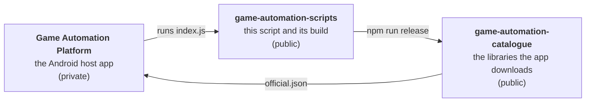

# Contributor guide

This site explains the **Tsum Tsum script** — an automation script that plays
Disney Tsum Tsum on Android through the **Game Automation Platform** host app —
to someone who has never opened its source. It covers what the script is, how
it is put together, how to make the changes people most often want to make, and
how to ship a build or publish a script library of your own.

It is written from the repository's own documents (`CODEMAP.md`,
`DEVELOPMENT.md`, `DRIVING_SCREENS.md`, `LOGGING.md`, `README.md` and the
generated `PAGE_DISPATCH.md` and `EVENTS.md`) with the detail kept and the
density taken out. Where a page shows code, it is pulled live from the
repository on GitHub, so what you read is what is on `main`.

## Where to start

| If you want to… | Read |
|:--|:--|
| understand what the script and the host app are | [What this is](getting-started/what-this-is) |
| build it and put it on a device | [Setup and first build](getting-started/setup-and-first-build) |
| know which file does what | [Repository tour](getting-started/repo-tour), then the [code map](reference/code-map) |
| understand how a run works, end to end | [Architecture](architecture/overview) |
| add a skill for a particular Tsum | [Add a skill](guides/add-a-skill) |
| add a setting to the settings page | [Add a setting](guides/add-a-setting) |
| make the script recognise or react to a screen | [Handle a page](guides/handle-a-page) |
| add a chore that runs on a schedule | [Add a scheduled task](guides/add-a-task) |
| write a log line or broadcast an event | [Logging and events](guides/logging-and-events) |
| run code when a round starts, a fever ends, a skill fires… | [Lifecycle hooks](guides/lifecycle-hooks) |
| test a change without a device | [Test without a device](guides/test-without-a-device) |
| publish a release, or host scripts the app can install | [Publishing](publishing/build-and-deploy) |
| know what a setting means | [Settings reference](reference/settings) |
| know the rules before opening a pull request | [Contributing](contributing/workflow) |

## The three repositories

- **The host app** loads a script folder, runs its `index.js` on an embedded
  JavaScript engine, shows its `index.html` as a settings page, and provides the
  natives the script calls: screenshots, colour reads, taps, shell commands.
- **This repository** is the Tsum Tsum script: TypeScript under
  `app.gap.Tsum/src/`, compiled into one bundle, plus the tooling that builds,
  checks and releases it.
- **The catalogue** is where releases land. The app reads its `official.json`
  and offers each entry for download. [Your own library source](publishing/your-own-library-source)
  shows how to publish one of your own.

A fourth, private repository holds the **development toolkit** — screenshots
of the game, the studio that authors screen fingerprints, the detection
regression. Comments in the source cite its commands by name (`pages:eval`,
`chain:bench`, `report:open`, …); none of those is a script in this package,
and nothing on this site needs it.

:::note Images
Screenshots have not been captured yet. Where one belongs you will see a dashed
box naming the image; `website/IMAGES_NEEDED.md` in the repository lists them
all.
:::
