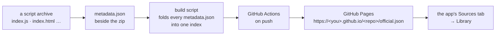

# Your own library source

The app installs scripts from **sources**: URLs that return a JSON catalogue.
The official one is built by the public `game-automation-catalogue`
repository and served from GitHub Pages; you can publish one exactly the same
way, and anyone can add it under the app's **Sources** tab. This page is the
whole recipe.



<ImagePlaceholder id="app-sources-tab" alt="The app's Sources tab: the built-in Official GAP source with its OFFICIAL badge, and the field to add a source URL" />

## 1. What a script archive must contain

A plain zip with the script's files at its root (or inside exactly one wrapper
folder, which the installer strips):

| File | Required | What |
|:--|:--|:--|
| `index.js` | one of these two | The script. A classic script, not a module: `start(settings)` and `stop()` must be global functions. |
| `index.html` | one of these two | The settings page. Must define `onEvent(type)` and `onLog(message)`; builds the settings object and evaluates `start(...)` through the host bridge. |
| `quickbar.html` | no | A Quick Bar page. A script without one simply has no Quick Bar button. |
| `images/` | no | Templates for the host's image matching. |
| anything else | no | Data files the script reads from its own folder — this script ships `tsums.dat`. |

The install fails if neither `index.js` nor `index.html` is at the root after
extraction. There is no manifest inside the archive: the script's game, name
and version come from the catalogue entry, and the app records them beside
the install.

For this repository, `npm run build` produces such an archive
(`TsumTsum-<Channel>-<version>.zip`).

## 2. Hash it

Every entry carries the SHA-256 of its zip as 64 hex characters. The app
computes the digest while downloading and **discards a file whose digest does
not match before writing anything**, so the hash is what makes a source safe
to trust with an install.

```bash
sha256sum TsumTsum-Beta-0.12.zip        # Linux / Git Bash
Get-FileHash TsumTsum-Beta-0.12.zip     # PowerShell
```

This repository's build writes it beside the archive as
`<archive>.zip.sha256`; the release tool re-hashes the bytes it copies.

## 3. The catalogue format

A source URL returns one JSON object:

```json
{
  "Name": "My Scripts",
  "Updated": "2026-09-11T10:00:00Z",
  "Scripts": [
    {
      "Game": "Tsum Tsum",
      "Name": "My Tsum Script",
      "Version": "1.0",
      "Date": "2026-09-11 10:00:00",
      "Hash": "006f503949df3dda5080375dc6ff24cd6f5aa9cbc5e3fbad549abb15ce9ae3a9",
      "File": "https://github.com/you/my-scripts/raw/main/Mine/TsumTsum/Beta/MyTsum-1.0.zip",
      "Message": "**Changes**\n1. First release.",
      "Versions": [
        { "Version": "1.0", "Date": "2026-09-11 10:00:00",
          "Hash": "006f503949df3dda5080375dc6ff24cd6f5aa9cbc5e3fbad549abb15ce9ae3a9",
          "File": "https://github.com/you/my-scripts/raw/main/Mine/TsumTsum/Beta/MyTsum-1.0.zip" }
      ]
    }
  ]
}
```

| Field | Required | Meaning |
|:--|:--|:--|
| `Name` | yes | The source's display name. **`Official GAP` is reserved** for the source built into the app; a user source claiming it is shown struck through, marked unsafe and refused. |
| `Updated` | no | When the index was built. Informational. |
| `Scripts[]` | yes | One entry per script. May be empty. |
| `Scripts[].Game` | yes | The game. Becomes a segment of the install folder: `scripts/<Source>/<Game>/<Name>/`. |
| `Scripts[].Name` | yes | The script's display name; the last segment of the install folder, spaces dashed. |
| `Scripts[].Version` | yes | Free-form; compared by equality. |
| `Scripts[].Date` | no | `YYYY-MM-DD HH:MM:SS`, UTC by convention. |
| `Scripts[].Hash` | yes | SHA-256 of the zip, 64 hex characters. |
| `Scripts[].File` | yes | An absolute `http(s)` URL to the zip. |
| `Scripts[].Message` | no | The release note, rendered as Markdown behind the card's notes button. A short numbered list reads best on a phone. |
| `Scripts[].Versions[]` | no | Builds still installable, newest first; the first row is the same build the entry's own fields describe. Each row needs `Version`, `Hash` and `File`. The app offers them in a menu on the card so a player can roll back. Omit it and the entry reads as a one-version history. |

An entry missing a required field is skipped and the rest of the catalogue
still loads. Keep the index small — the app caps a catalogue at about 2 MB —
which is why a history row carries no `Message`.

## 4. Host it on GitHub Pages

The official catalogue is the worked example, and copying its layout gets you
its build script and workflow for free.

### The layout

```
my-scripts/
├── .github/workflows/build-official.yml   builds the index and publishes it
├── build-official.sh                      folds every metadata.json into official.json
├── build-official.ps1                     the same, for PowerShell
├── .gitignore                             official.json  (generated, never committed)
└── <Publisher>/<Game>/<Channel>/
    ├── MyTsum-1.0.zip                     the archive(s)
    ├── metadata.json                      one entry, File relative to this folder
    └── CHANGELOG.md                       optional, for people
```

Per-script `metadata.json` files are the entries above with one difference:
`File` (and each `Versions[].File`) is a **filename relative to that folder**,
and the build script rewrites it into the raw download URL for that file,
derived from the repository's own `origin` remote and current branch:

```json reference title="game-automation-catalogue/Official/LineTsumTsum/Beta/metadata.json"
https://github.com/game-automation-platform/game-automation-catalogue/blob/master/Official/LineTsumTsum/Beta/metadata.json
```

### The build script

Reads every `metadata.json` under the repository, rewrites each `File` to
`https://github.com/<owner>/<repo>/raw/<branch>/<path>`, and writes
`official.json`. It needs `jq`. **Change the default `Name`** near the end —
`Official GAP` is the one name the app refuses:

```bash reference title="game-automation-catalogue/build-official.sh"
https://github.com/game-automation-platform/game-automation-catalogue/blob/master/build-official.sh
```

### The workflow

On every push that touches a `metadata.json`, the workflow runs the script and
publishes `official.json` to GitHub Pages. `official.json` is never committed.

```yaml reference title="game-automation-catalogue/.github/workflows/build-official.yml"
https://github.com/game-automation-platform/game-automation-catalogue/blob/master/.github/workflows/build-official.yml
```

### Turn on Pages

In the repository on GitHub: **Settings → Pages → Build and deployment →
Source: GitHub Actions**. Push, wait for the *Build official.json* workflow to
go green, and the index is at
`https://<owner>.github.io/<repo>/official.json`.

<ImagePlaceholder id="github-pages-settings" alt="A repository's Settings → Pages screen with Source set to GitHub Actions" />

Any other static host works the same way — the app does a plain HTTP GET and
follows redirects. Raw GitHub URLs (`raw.githubusercontent.com`, or
`github.com/<owner>/<repo>/raw/<branch>/...`) serve the zips; Pages is only
needed for the index because the app caches what it fetched and re-checks it
on each launch.

## 5. Add it in the app

Open the **Sources** tab, add the URL, and the Library lists what the source
publishes with a download disc beside anything not yet installed. The app
re-checks every source once per launch and on the refresh button; a script
whose published hash differs from the installed one gets an **UPDATE** badge.

<ImagePlaceholder id="app-source-added" alt="The Sources tab after adding a custom source, showing its name, URL and script count, and the Library listing its script" />

Anything added here is unverified: a source can publish any archive under any
name, which is why the hash check exists and why the app's own dialog says to
add only sources you trust.

## 6. Publishing an update

1. Build the new zip and hash it.
2. In `metadata.json`, set the top-level fields to the new build and prepend a
   row to `Versions` (keep the previous rows you still want installable; drop
   the archives you remove).
3. Add a section to the folder's `CHANGELOG.md` if you keep one.
4. Commit the zip and the metadata, push, and let the workflow publish.

This repository's `npm run release:<channel>` does exactly these steps for
the official catalogue — [Release to the catalogue](release-to-catalogue) —
and `tools/release/release.js` is a reasonable starting point for a release
script of your own.
